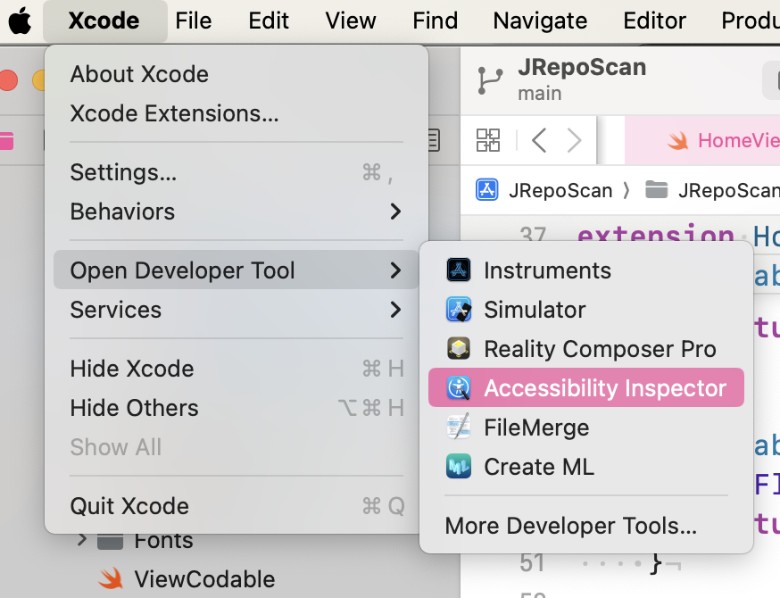

# JRepoScan


> Este projeto é um aplicativo que consome a API do GitHub para buscar repositórios populares escritos em Java. Ele exibe rapidamente esses repositórios, mostra seus pull requests abertos e conta com acessibilidade e testes unitários.

### Features em andamento

Esse aplicativo conta com as seguintes Features:

- [x] Layout em ViewCode (MVVM)
- [x] Paginação na tela de lista
- [x] Acessibilidade
- [x] Programação reativa
- [x] Testes unitários
- [x] Injeção de dependências
- [ ] Testes instrumentados

### Melhorias futuras

Foram mapeadas as seguintes melhorias:

- [ ] Acessibilidade em outro idioma fora do sistema operacional.
- [ ] Injeção de dependência nas views e viewmodels


## 💻 Pré-requisitos

Antes de começar, verifique se você atendeu aos seguintes requisitos:

- Você tem uma máquina `Mac`.
- Você instalou a versão minima de 15.4 do `xcode`.
- Conexão com a internet para instalar pacotes via `Swift Package Manager`.

## ☕ Usando JRepoScan sem Acessibilidade

Para usar JRepoScan, siga estas etapas:

```
Clone o repositório

Abra o .xcodeproj ou .xcworkspace no Xcode

O SPM instalará automaticamente as dependências na primeira build

Execute no simulador (Cmd + R)
```

## ☕ Usando JRepoScan com Acessibilidade

Para usar JRepoScan, siga estas etapas:

```
Execute o projeto no simulador normalmente

No Xcode, abra o menu:
Xcode > Open Developer Tool > Accessibility Inspector

Use o inspetor para verificar os elementos da interface

```


## 🤝 Quem sou eu

<div align="center">
  
  <h3>Michelli Cristina</h3>
  <p>👩‍💻 Desenvolvedora iOS<br>🎓 Pós-graduanda em Engenharia de Software e Desenvolvimento Mobile</p>
  <a href="https://github.com/mihcristina">🔗 GitHub</a> • 
  <a href="https://linkedin.com/in/mihcristina">📫 LinkedIn</a>
</div>

## 📝 Licença

Esse projeto está sob licença. Veja o arquivo [LICENÇA](LICENSE.md) para mais detalhes.
